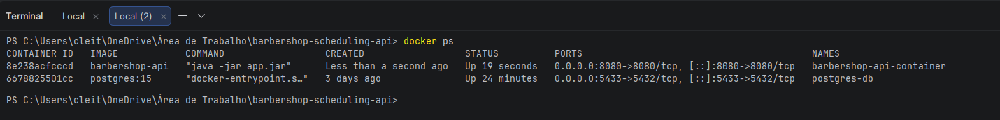
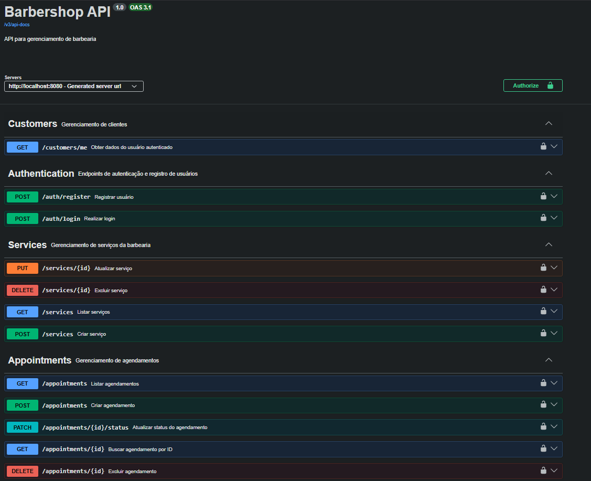
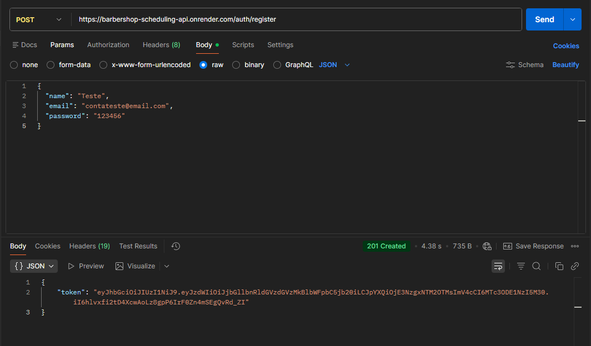
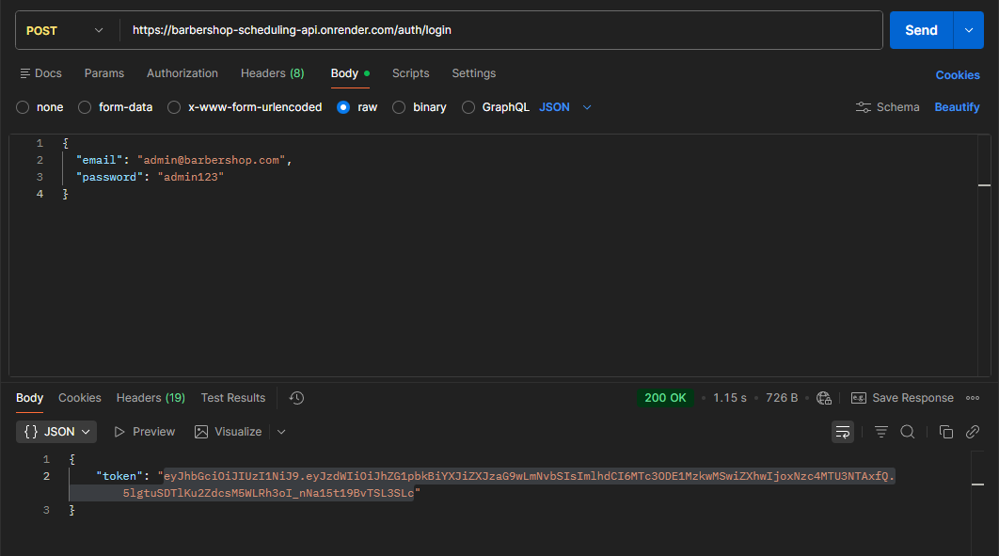
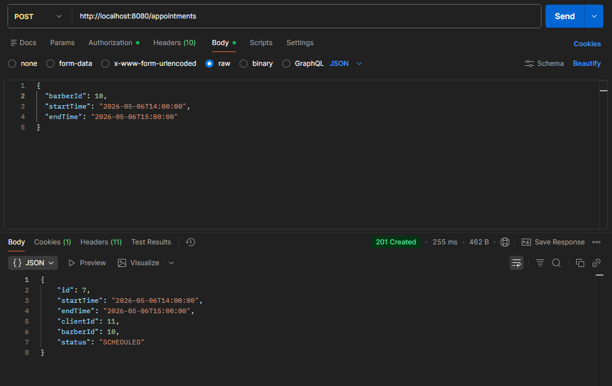
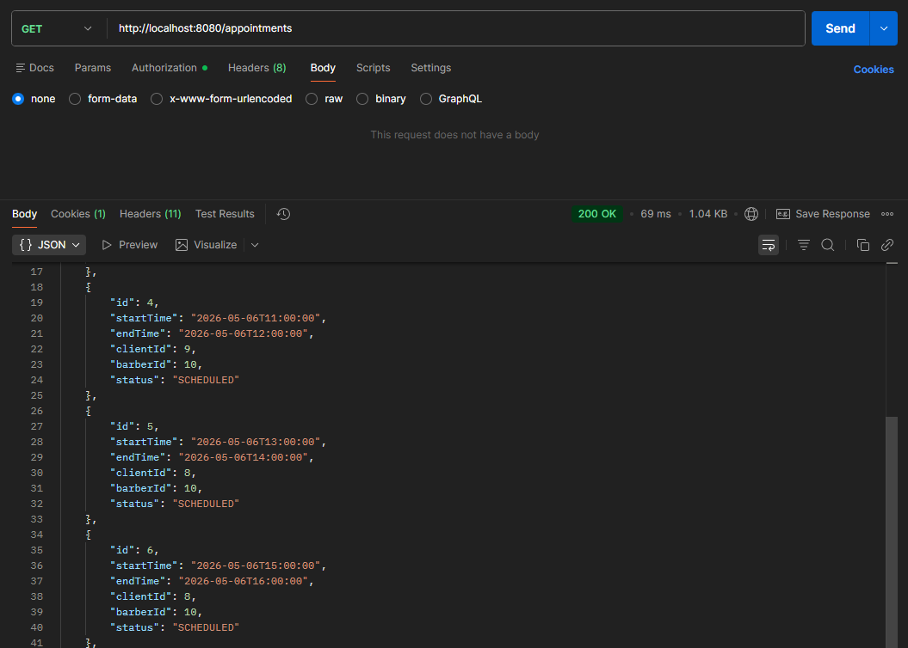

# 💈 Barbershop API

> API REST para gerenciamento de barbearia — agendamentos, serviços e clientes.


---

## 🚀 Projeto em Produção

> A API está no ar e pode ser acessada agora mesmo!

🔗 **Swagger:** [barbershop-scheduling-api.onrender.com/swagger-ui/index.html](https://barbershop-scheduling-api.onrender.com/swagger-ui/index.html)

> ⚠️ **Atenção:** A API está hospedada no plano gratuito do Render. Na primeira requisição pode levar até **60 segundos** para responder enquanto o servidor inicializa. Após isso, funciona normalmente.

### 🔑 Contas Demo

Use as contas abaixo para testar a API sem precisar criar uma conta:

| Perfil | Email | Senha | Permissões |
|--------|-------|-------|------------|
| 👑 Owner | `admin@barbershop.com` | `admin123` | Acesso total |
| 💈 Barber | `barber@barbershop.com` | `123456` | Agendamentos e serviços |

---

## 📋 Índice

- [Sobre o Projeto](#sobre-o-projeto)
- [Tecnologias](#tecnologias)
- [Arquitetura](#arquitetura)
- [Como Rodar](#como-rodar)
- [Documentação da API](#documentação-da-api)
- [Endpoints](#endpoints)
- [Testes](#testes)
- [Testes no Postman](#testes-no-postman)

---

## 📖 Sobre o Projeto

API desenvolvida para gerenciar uma barbearia, permitindo o cadastro de clientes, serviços e agendamentos. O sistema conta com autenticação JWT, controle de acesso por perfil de usuário (enums `Perfil` e `Status`), tratamento global de exceções e documentação automática via Swagger.

---

## 🛠️ Tecnologias

- **Java 21** — versão LTS mais recente da linguagem
- **Spring Boot** — framework principal para criação da API
- **Spring Security + JWT** — autenticação e autorização com token
- **Spring Data JPA + Hibernate** — mapeamento objeto-relacional
- **PostgreSQL** — banco de dados relacional
- **Docker / Docker Compose** — containerização da aplicação e do banco
- **Swagger / OpenAPI 3.1** — documentação interativa da API
- **JUnit 5 + Mockito** — testes unitários
- **Spring Boot Test** — testes de integração
- **Render** — plataforma de deploy em produção

---

## 🏗️ Arquitetura

O projeto segue uma arquitetura em camadas bem definida:

```
src/
├── config/
│   ├── DatabaseSeeder        # Dados iniciais no banco
│   ├── JwtFilter             # Filtro de autenticação JWT
│   ├── SecurityConfig        # Configurações do Spring Security
│   └── SwaggerConfig         # Configurações do Swagger/OpenAPI
├── controller/
│   ├── AppointmentController
│   ├── AuthController
│   ├── BarbershopServiceController
│   └── CustomerController
├── dto/
│   ├── AppointmentResponse
│   ├── AuthResponse
│   ├── CreateAppointmentRequest
│   ├── CreateCustomerRequest
│   ├── CreateServiceRequest
│   ├── CustomerResponse
│   ├── ErrorResponse
│   ├── LoginRequest
│   ├── ServiceResponse
│   └── UpdateStatusRequest
├── entity/
│   ├── Appointment
│   ├── BarbershopService
│   └── Customer
├── enums/
│   ├── Perfil                # Perfis de acesso (OWNER, BARBER)
│   └── Status                # Status dos agendamentos
├── exception/
│   ├── BusinessException
│   ├── EmailAlreadyExistsException
│   ├── GlobalExceptionHandler
│   └── NotFoundException
├── repository/
│   ├── AppointmentRepository
│   ├── BarbershopServiceRepository
│   └── CustomerRepository
├── service/
│   ├── AppointmentService
│   ├── AuthService
│   ├── BarbershopServiceService
│   ├── CustomerService
│   └── JwtService
└── BarbershopSchedulingApiApplication
```

---

## 🚀 Como Rodar

### Pré-requisitos

- Docker e Docker Compose instalados
- Java 21 (caso queira rodar localmente sem Docker)

### Subindo com Docker

```bash
# Clone o repositório
git clone https://github.com/ClaytonBC/barbershop-api.git

# Entre na pasta
cd barbershop-api

# Suba os containers
docker-compose up -d
```

A API estará disponível em: `http://localhost:8080`

### 🐳 Docker rodando

<!-- 📸 PRINT: containers rodando (docker ps ou Docker Desktop) -->


---

## 📚 Documentação da API

Acesse o Swagger UI em: `http://localhost:8080/swagger-ui/index.html`

<!-- 📸 PRINT: print geral do Swagger com todos os endpoints listados -->


---

## 🔗 Endpoints

### 🔐 Autenticação

| Método | Endpoint | Descrição | Auth |
|--------|----------|-----------|------|
| `POST` | `/auth/register` | Registrar novo usuário | ❌ |
| `POST` | `/auth/login` | Realizar login e obter token JWT | ❌ |

### 👤 Clientes

| Método | Endpoint | Descrição | Auth |
|--------|----------|-----------|------|
| `GET` | `/customers/me` | Obter dados do usuário autenticado | ✅ |

### ✂️ Serviços

| Método | Endpoint | Descrição | Auth |
|--------|----------|-----------|------|
| `GET` | `/services` | Listar todos os serviços | ✅ |
| `POST` | `/services` | Criar novo serviço | ✅ |
| `PUT` | `/services/{id}` | Atualizar serviço | ✅ |
| `DELETE` | `/services/{id}` | Excluir serviço | ✅ |

<!-- 📸 PRINT: GET /services com response 200 listando os serviços -->


### 📅 Agendamentos

| Método | Endpoint | Descrição | Auth |
|--------|----------|-----------|------|
| `GET` | `/appointments` | Listar agendamentos | ✅ |
| `POST` | `/appointments` | Criar agendamento | ✅ |
| `GET` | `/appointments/{id}` | Buscar agendamento por ID | ✅ |
| `PATCH` | `/appointments/{id}/status` | Atualizar status do agendamento | ✅ |
| `DELETE` | `/appointments/{id}` | Excluir agendamento | ✅ |

---

## 🧪 Testes

O projeto conta com cobertura de testes em dois níveis:

### Testes Unitários

Testam as regras de negócio de forma isolada usando **JUnit 5 + Mockito**, sem subir o contexto do Spring.

```bash
./mvnw test
```

### Testes de Integração

Testam o fluxo completo da aplicação subindo o contexto do Spring com banco em memória.

```bash
./mvnw verify
```

---

## 📬 Testes no Postman

<!-- 📸 PRINT: POST /auth/register com body e response 201 + token JWT -->


<!-- 📸 PRINT: POST /auth/login com response 200 e token JWT retornado -->


<!-- 📸 PRINT: POST /appointments funcionando com token no header Authorization -->


<!-- 📸 PRINT: GET /appointments listando os agendamentos criados -->


---

## 👤 Autor

Feito por **[Clayton](https://github.com/ClaytonBC)** 🚀
